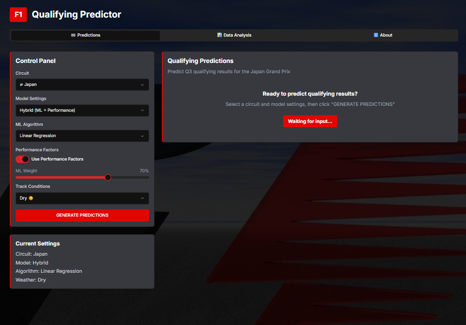

# 🏎️ F1QualiPredictor

**Accurately predict Formula 1 qualifying results using machine learning and performance-based heuristics.**  
Built with [FastF1](https://theoehrly.github.io/Fast-F1/), `scikit-learn`, and `Streamlit`.

---

This is how F1QualiPredictor looks in action

---

## 📌 Overview

**F1QualiPredictor 2025** is a Python-based application that predicts Q3 qualifying times for upcoming Formula 1 races. It combines historical performance data with machine learning and driver/team heuristics to simulate realistic qualifying outcomes.

Built for fans, analysts, and developers who love the intersection of motorsport and machine intelligence.

---

## 🏁 Features

- **Data Collection**: Fetches qualifying data from the FastF1 API
- **Machine Learning**: Predicts Q3 times using various regression models
- **Performance Factors**: Incorporates driver and team-specific adjustments
- **Interactive Dashboard**: Visualizes predictions and historical data with F1-inspired design
- **Hybrid Prediction**: Combines ML and heuristic approaches for accurate results

---

## 📊 Interface Features

The application provides a vibrant, F1-themed interface with:

- **Predictions Tab**: View qualifying predictions with team-colored visualizations
- **Data Analysis Tab**: Explore historical qualifying data and model performance
- **About Tab**: Learn about the application and how it works

---
## 🏎️ Prediction Features

The application offers several prediction options:

- **Hybrid Model**: Combines machine learning predictions with performance factors
- **ML Only**: Uses only machine learning for predictions
- **Performance Factors Only**: Uses only team and driver performance factors

You can also adjust:
- ML algorithm (Linear Regression, Ridge, Random Forest, Gradient Boosting)
- Weather conditions (Dry, Damp, Wet)
- ML weight vs. performance factors

---

## 📈 Data Analysis

The application provides several data analysis features:
- Historical qualifying data visualization
- Circuit performance comparison
- Driver and team performance analysis
- Model performance metrics and visualizations

---

## 🛠️ Technical Details

### Data Collection

The application uses the FastF1 API to fetch qualifying data from past F1 races. The data includes:
- Driver name and team
- Q1, Q2, and Q3 lap times
- Circuit information
- Session timestamps

### Machine Learning Models

Several regression models are available:
- Linear Regression
- Ridge Regression
- Random Forest
- Gradient Boosting

### Performance Factors

The application incorporates driver and team-specific performance factors to adjust predictions:
- Team performance multipliers
- Driver performance multipliers
- Circuit-specific adjustments
- Weather condition factors

---

## 🧪 Technologies Used

- 🏎 FastF1
- 📊 scikit-learn
-  📈 pandas, numpy, matplotlib, seaborn
-  🖥️ Streamlit
-  🧠 Custom heuristics layer

---

## 📌 Roadmap
- Basic ML model (Linear Regression)
- Performance factor integration
- Streamlit dashboard
- Track-specific modifiers
- Weather condition layer
- Simulated quali session builder
- Streamlit Cloud deployment

 
---
## 🚀 Getting Started

### 🌐 Live Demo
Check this project out at https://f1-quali-predictor.vercel.app/

---

## 🙏 Acknowledgments

- [FastF1](https://github.com/theOehrly/Fast-F1) for providing access to F1 data
- [Streamlit](https://streamlit.io/) for the interactive web interface
- Formula 1 for the inspiration

